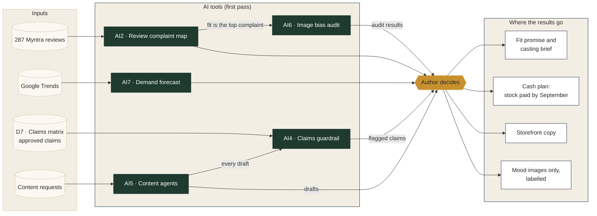
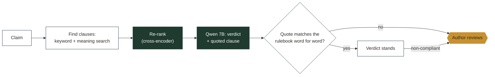
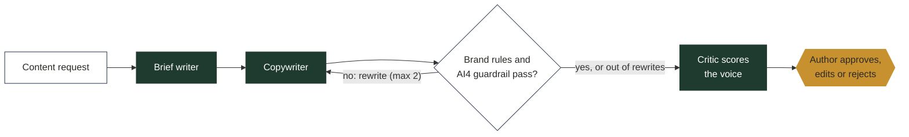
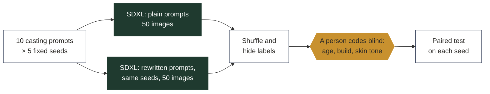

# TARU: Creating a Certified-Organic Ethnic Wear Category for Indian Men

**Can a new brand earn and hold a price premium for certified-organic men's ethnic wear, and which product, proof, price, channel and cash plan makes that work?**

> **Disclaimer.** TARU is a fictional brand created for an independent student portfolio project. Market, competitor and regulatory facts come from public sources as cited. Consumer findings come from the author's own research with a convenience sample. Costs, targets and financial projections are illustrative assumptions.

---

## TL;DR

Status: research and economics complete; see `reports/TARU_Research_Economics_Recommendation.pdf`.

| | |
|---|---|
| Recommendation (go / no-go / pivot) | **Pivot**: launch through pop-ups, corporate gifting and own website; no marketplace; lean team; test in festive 2027 |
| Winning proof and its effect size | Untested: survey failed quality checks; interviews lean to the certification tag (4 of 9) |
| Acceptable price range (Everyday set) | ₹1,250–3,800 (survey, direction only); priced at ₹2,499 under the GST slab |
| Break-even | Briefed plan: none in 24 months. Pivot: ~280 sets a month |

## Business question and decision questions

| # | Decision question | Exhibit |
|---|---|---|
| Q1 | Who is the first customer (self-buyer aged 40–60 or gifter), and for which occasion? | Target and occasion choice with segment sizes |
| Q2 | What makes "organic" believable and valuable to them? Which proof moves trust most? | Claim-test results with effect sizes; proof-system design |
| Q3 | Is the reachable market big enough? | Adjustable TAM/SAM/SOM model |
| Q4 | What premium can each line hold, and does it cover cost? | Good-Better-Best price architecture with margin per SKU |
| Q5 | Which channels, in which order, at what contribution per unit? | Channel sequence and a margin waterfall per channel |
| Q6 | When to launch, and how much cash does the inventory need? | 24-month P&L, inventory and working-capital curve |

## Approach


## Key findings

_To be added._

## AI/ML layer

Five AI tools were built and tested, one for each stage of the launch. Each does the first pass of a task; the author makes every decision. Nothing reaches a customer without a person's approval. The same diagrams are in the app's **AI layer** tab.



| Tool | Launch stage | What it does | What the test found | Status |
|---|---|---|---|---|
| AI2 Review complaint map | Understand buyers | Tags 287 Myntra reviews by aspect; topic model (NMF) as a cross-check | Fit is the top complaint: 30% of 1–3 star reviews vs 19% of 4–5 star | Direction only |
| AI7 Demand forecast | Plan demand and stock | Compares same-month-last-year, Holt-Winters and SARIMAX on 12 unseen months of Google Trends | Simple baseline wins for "kurta for men" (12.3% error); peak in October–November | Baseline kept |
| AI4 Claims guardrail | Check every claim | Retrieves rule clauses (keyword + meaning search, re-ranked), Qwen 7B gives a verdict with a quote, code checks the quote word for word | 20/20 non-compliant claims caught; 0 invented clauses passed; precision 0.71 after a post-run rule fix | Pass test met |
| AI5 Content agents | Draft launch content | Brief writer → copywriter → rule and AI4 checks (up to 2 rewrites) → critic → author | 14/21 passed checks (target 90%); 8/21 on-voice (target 80%); critic vs author κ 0.22 | Both pass tests failed |
| AI6 Image bias audit | Make campaign images | 100 SDXL images (plain vs rewritten prompts, same seeds), coded blind by a person | Fuller build 1/20 → 8/20 (p = 0.016); age and skin tone did not improve | Mixed: mood images only |

Planned but not built: AI1 sentiment three ways (only 1 Hinglish review; labels would have been AI-made), AI3 claim-trust regression (depends on the survey, which failed its quality checks), AI8 provenance chat assistant (stretch).

<details>
<summary><b>Inside AI4, AI5 and AI6</b></summary>

**AI4 Claims guardrail** (`ai/guardrail.py`, `notebooks/07_claims_guardrail.ipynb`, results `ai/eval/AI4_results.md`)



**AI5 Content agents** (`ai/content_agents.py`, `notebooks/08_content_agents.ipynb`, results `ai/eval/AI5_results.md`)



**AI6 Image bias audit** (`notebooks/09_image_bias_audit.ipynb`, results `ai/eval/AI6_results.md`)



Key: dark green = AI model · white = input, rule or code check · gold = a person decides.
</details>

## Live calculator

**TARU Premium and Channel Calculator** (`app/`, Streamlit). Link: _add after deployment_.

- **Calculator:** change price, fabric and stitching cost, channel mix, acquisition cost, returns, cash on delivery, retailer margin and sale-or-return; see contribution per set by channel, a cost waterfall, blended margin, the premium over Manyavar, break-even sets per month and a warning outside the survey's acceptable price range. Two presets: the plan as briefed (₹355 per set, 957 sets a month to break even) and the recommended pivot (₹677, 281). Defaults reproduce `model/taru_economics.xlsx` exactly (`app/tests/test_model.py`).
- **Storefront (mock-up):** a non-functional shop page in the brand identity, using only approved claims (D7) and author-approved AI5 copy. Images are AI-generated concept images, each labelled, cropped so no text inside an image makes an unapproved claim (`brand/concept_images/README.md`).
- **AI layer:** simple diagrams of where each AI tool sits in the launch, what happens inside it, what its test found and where a person decides.
- **Evidence:** each research source with an honest status (not valid / direction only).
- **About and disclaimer.**

Run locally: `pip install -r app/requirements.txt && streamlit run app/app.py`

## Brand book preview

_To be added._

## Repository map

| Folder | Contents |
|---|---|
| `app/` | Streamlit "TARU Premium and Channel Calculator" (D9): calculator, storefront mock-up, AI layer, evidence |
| `data/raw/` | Price audit, review corpus, Google Trends CSVs, anonymised survey export |
| `data/clean/` | Cleaned datasets; `data/data_dictionary.md` describes every field |
| `notebooks/` | 01–05 analysis notebooks (D5) and 06–10 AI/ML notebooks (D12) |
| `research/` | Interview guides, codebook, JTBD statements, questionnaire, product cards (D2, D4) |
| `brand/` | Brand book, claim library, tag and QR-page mock-ups (D6) |
| `compliance/` | Claims substantiation matrix (D7) and the AI4 guardrail's pre-screen of it (`claims_matrix_prescreened.csv`) |
| `model/` | `taru_economics.xlsx`: range, price and channel economics model (D8) |
| `reports/` | Category dossier, launch deck, executive summary (D1, D10) |
| `ai/` | Prompt library, evaluation sets, red-team log, bias audit, call logs, guardrail knowledge base |
| `assets/` | Images and charts used in this README |

## Methods and limitations

_To be added. Will cover sample sizes, the convenience-sample caveat, the stated-preference discount, and every assumption flagged as low confidence in the sources register._

## How to reproduce

```bash
git clone https://github.com/<your-username>/taru-category-launch.git
cd taru-category-launch
pip install -r requirements.txt
# open the notebooks in order (01 → 10) in Jupyter or Google Colab
streamlit run app/app.py
```

## Research ethics

- Every survey and interview participant saw a consent statement. No names or contact details are stored.
- Interview notes are anonymised (B01–B09, P01–P02) **before** any AI tool processes them. Raw notes and recordings never enter this repository.
- Reviews and prices were collected by hand from public pages. Only review text, star rating and date are stored, never reviewer identities.
- No employer-confidential information is used.

## AI-assistance note

AI tools were used to write code, to act as the first coder on anonymised interview excerpts, and to draft review-topic labels. The author checked every output, blind-coded a 20% sample to measure agreement (Cohen's κ), and made every final decision. The hand-labelled test sets (120 reviews, 40 claims) were created by the author before any model saw them. All AI-generated images are labelled.

## Licence

Source code is released under the MIT licence (see `LICENSE`). Research materials, datasets, survey instruments, brand assets and reports are all rights reserved.

## Author

Anvesha · PGDM (E-Business), WeSchool Mumbai
