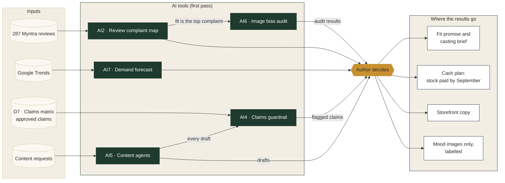
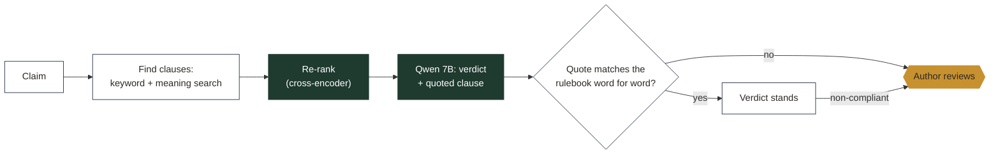
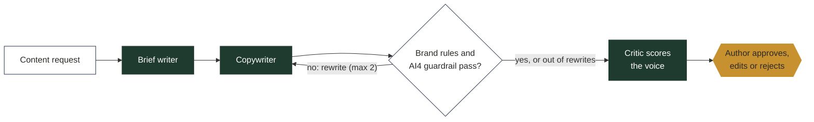
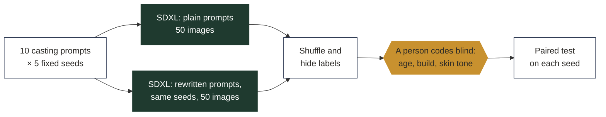
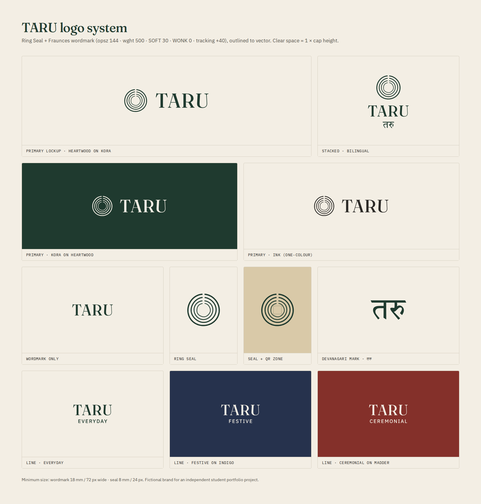
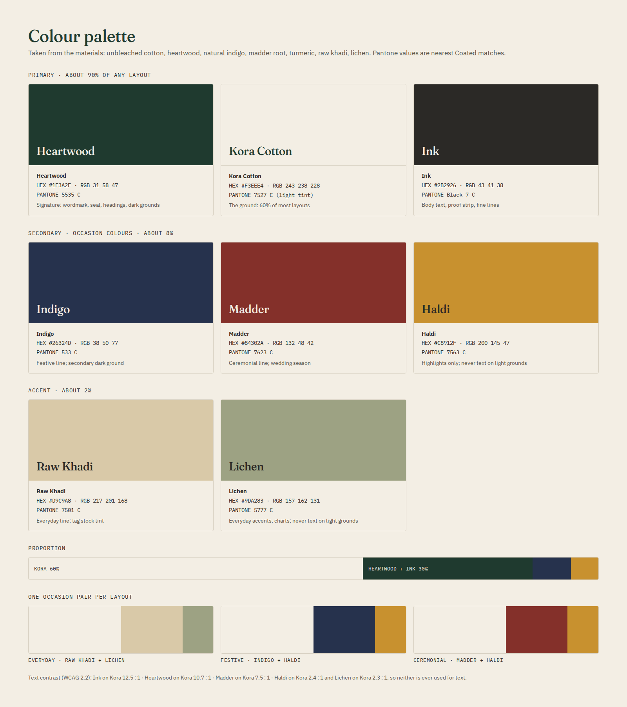
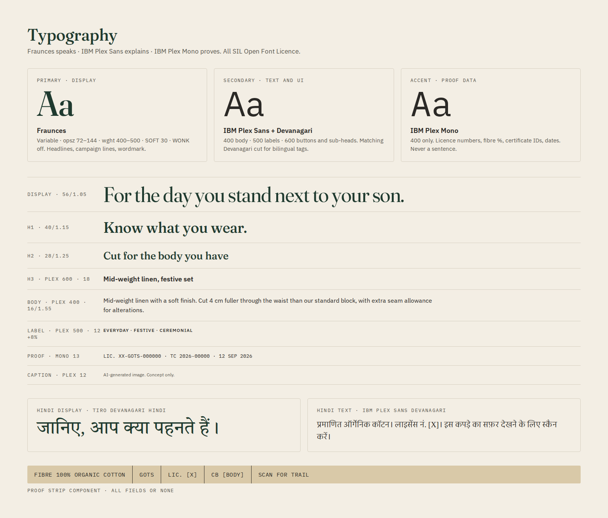

# TARU: Creating a Certified-Organic Ethnic Wear Category for Indian Men

**Can a new brand earn and hold a price premium for certified-organic men's ethnic wear, and which product, proof, price, channel and cash plan makes that work?**

> **Disclaimer.** TARU is a fictional brand created for an independent student portfolio project. Market, competitor and regulatory facts come from public sources as cited. Consumer findings come from the author's own research with a convenience sample. Costs, targets and financial projections are illustrative assumptions.

---

## TL;DR

Status: research, economics and AI layer complete. **Live app:** [open it here](https://taru-category-launch-pqj9ydg5bqruvwrz8mjxch.streamlit.app/) · full report: `reports/TARU_Research_Economics_Recommendation.pdf`.

| | |
|---|---|
| Recommendation (go / no-go / pivot) | **Pivot**: launch through pop-ups, corporate gifting and own website; no marketplace; lean team; test in festive 2027 |
| Winning proof and its effect size | Untested: pilot survey sample too small to use; interviews lean to the certification tag (4 of 9) |
| Acceptable price range (Everyday set) | ₹1,250–3,800 (survey, direction only); priced at ₹2,499 under the GST slab |
| Break-even | Briefed plan: none in 24 months. Pivot: ~280 sets a month |

## Business question and decision questions

| # | Decision question | Exhibit |
|---|---|---|
| Q1 | Who is the first customer (self-buyer aged 40–60 or gifter), and for which occasion? | Target and occasion choice with segment sizes |
| Q2 | What makes "organic" believable and valuable to them? Which proof moves trust most? | Claim-test results with effect sizes; proof-system design |
| Q3 | Is the reachable market big enough? | Adjustable TAM/SAM/SOM model |
| Q4 | What premium can each line hold, and does it cover cost? | Good-Better-Best price architecture with margin per SKU |
| Q5 | Which channels, in which order, at what contribution per unit? | Channel sequence and a margin waterfall per channel |
| Q6 | When to launch, and how much cash does the inventory need? | 24-month P&L, inventory and working-capital curve |

## Approach


## Key findings

**Recommendation: pivot, then test.** As briefed (four channels including a marketplace, full team), TARU loses about ₹73 lakh over 24 months and never breaks even. A leaner launch through festive pop-ups, corporate gifting and its own website needs about 280 sets a month, close to the year-2 plan of 250. The festive 2027 pop-up season is the test.

| # | Question | Answer | Evidence | Confidence |
|---|---|---|---|---|
| Q1 | First customer and occasion | Self-buyer aged 40–60, for festive and wedding occasions; corporate festive gifting as the second route | Interviews; survey had only 6 gifters | Direction only |
| Q2 | What makes "organic" believable | **Fit and comfort lead; certification is the proof.** 8 of 9 buyers named a fit problem; fit is the top complaint in competitor reviews (30% of 1–3 star vs 19% of 4–5 star); buyers read "organic" as skin comfort (4 of 9) before planet (3); the certification tag was the most chosen proof (4 of 9) | Interviews, AI2 review mining; survey claim test inconclusive | Direction only |
| Q3 | Is the market big enough | A gap exists: none of the 29 competitor sets audited makes an organic or certification claim, and 12 of 15 Manyavar sets are viscose, georgette, art silk or brocade. Searches for "wedding outfit for men" doubled and "linen kurta" more than tripled, 2021–2026 | Price audit, Google Trends, desk sizing | Medium |
| Q4 | Premium and margin | A premium over Manyavar holds for festive and ceremonial, **not everyday** (10% over Manyavar ≈ ₹2,900; buyers expect ₹2,000–2,200). **No line reaches a 50% gross margin** (37%, 36%, 28%) against Manyavar's 65.7% on mostly viscose | Price audit, interviews, cost model | Medium; costs partly assumed |
| Q5 | Channels and order | **The marketplace loses money on every line** at a 27.5% commission. Pop-ups earn the most per set (₹360–1,446), then the own website and corporate gifting | Channel waterfalls | Medium; commission is a press estimate |
| Q6 | Timing and cash | Demand peaks October–November, so stock must be paid for by September. As briefed: break-even ~957 sets a month, peak funding ₹77.6 lakh. Pivot: ~281 sets a month, ₹27.5 lakh | Google Trends, AI7, 24-month model | Medium |

**Go / no-go for the test:** run 3–4 pop-ups in October–November 2027. Continue only if they sell at least ~280 sets a month at full price with returns under 5%.

**What would change the call:** a certified fabric source under ₹140 per metre for festive linen; a marketplace commission under 15%; or a larger, clean survey showing that certification lifts trust.

**Compliance:** 22 planned claims were checked against 8 rules and standards (Indian law, ASCI codes and GOTS). 6 can be used now, 7 only once certificates exist, 5 are banned, 3 are survey stimuli only and 1 is on hold (`compliance/claims_matrix.csv`).

Full detail: `reports/TARU_Research_Economics_Recommendation.pdf` and `reports/TARU_Regulation_Brief.pdf`. AI results are under [AI/ML layer](#aiml-layer).

## AI/ML layer

Five AI tools were built and tested, one for each stage of the launch. Each does the first pass of a task; the author makes every decision. Nothing reaches a customer without a person's approval. The same diagrams are in the app's **AI layer** tab.



| Tool | Launch stage | What it does | What the test found | Status |
|---|---|---|---|---|
| AI2 Review complaint map | Understand buyers | Tags 287 Myntra reviews by aspect; topic model (NMF) as a cross-check | Fit is the top complaint: 30% of 1–3 star reviews vs 19% of 4–5 star | Direction only |
| AI7 Demand forecast | Plan demand and stock | Compares same-month-last-year, Holt-Winters and SARIMAX on 12 unseen months of Google Trends | Simple baseline wins for "kurta for men" (12.3% error); peak in October–November | Baseline kept |
| AI4 Claims guardrail | Check every claim | Retrieves rule clauses (keyword + meaning search, re-ranked), Qwen 7B gives a verdict with a quote, code checks the quote word for word | 20/20 non-compliant claims caught; 0 invented clauses passed; precision 0.71 after a post-run rule fix | Pass test met |
| AI5 Content agents | Draft launch content | Brief writer → copywriter → rule and AI4 checks (up to 2 rewrites) → critic → author | 14/21 passed checks (target 90%); 8/21 on-voice (target 80%); critic vs author κ 0.22 | Below target |
| AI6 Image bias audit | Make campaign images | 100 SDXL images (plain vs rewritten prompts, same seeds), coded blind by a person | Fuller build 1/20 → 8/20 (p = 0.016); age and skin tone did not improve | Mixed: mood images only |

Planned but not built: AI1 sentiment three ways (only 1 Hinglish review; labels would have been AI-made), AI3 claim-trust regression (depends on the survey claim test, whose pilot sample was too small to use), AI8 provenance chat assistant (stretch).

<details>
<summary><b>Inside AI4, AI5 and AI6</b></summary>

**AI4 Claims guardrail** (`ai/guardrail.py`, `notebooks/07_claims_guardrail.ipynb`, results `ai/eval/AI4_results.md`)



**AI5 Content agents** (`ai/content_agents.py`, `notebooks/08_content_agents.ipynb`, results `ai/eval/AI5_results.md`)



**AI6 Image bias audit** (`notebooks/09_image_bias_audit.ipynb`, results `ai/eval/AI6_results.md`)



Key: dark green = AI model · white = input, rule or code check · gold = a person decides.
</details>

## Live calculator

**TARU Premium and Channel Calculator** (`app/`, Streamlit): **[open the live app](https://taru-category-launch-pqj9ydg5bqruvwrz8mjxch.streamlit.app/)**

- **Calculator:** change price, fabric and stitching cost, channel mix, acquisition cost, returns, cash on delivery, retailer margin and sale-or-return; see contribution per set by channel, a cost waterfall, blended margin, the premium over Manyavar, break-even sets per month and a warning outside the survey's acceptable price range. Two presets: the plan as briefed (₹355 per set, 957 sets a month to break even) and the recommended pivot (₹677, 281). Defaults reproduce `model/taru_economics.xlsx` exactly (`app/tests/test_model.py`).
- **Storefront (mock-up):** a non-functional shop page in the brand identity, using only approved claims (D7) and author-approved AI5 copy. Images are AI-generated concept images, each labelled, cropped so no text inside an image makes an unapproved claim (`brand/concept_images/README.md`).
- **AI layer:** simple diagrams of where each AI tool sits in the launch, what happens inside it, what its test found and where a person decides.
- **Evidence:** each research source with an honest status (inconclusive / direction only).
- **About and disclaimer.**

Run locally: `pip install -r app/requirements.txt && streamlit run app/app.py`

## Brand book preview

**TARU** (तरु, Sanskrit for *tree*) is built on one idea: *a garment should be able to prove what it says about itself.* A tree records its history in its rings; TARU treats each stage of a garment (farm, gin, mill, garment) as one ring, each certified and readable on the garment's QR proof page.

| Logo system | Colour palette | Typography |
|---|---|---|
|  |  |  |

- **Visual concept, "Heartwood":** the Ring Seal (four rings for the four certified stages), the Grain Line (one fine rule through every layout) and the Proof Strip (fibre %, certifier, licence, trail link in monospace). No leaves, globes or green gradients: the shorthand of greenwashing.
- **Type:** Fraunces speaks, IBM Plex Sans explains, IBM Plex Mono proves. All free (SIL Open Font Licence).
- **Colour:** Heartwood green, Kora cotton and Ink for about 90% of any layout; one occasion pair per line (Everyday: raw khadi + lichen; Festive: indigo + haldi; Ceremonial: madder + haldi).
- **Voice:** "the elder who knows, and cares enough to show you." Few words, specific, warm, no hype. Every public line needs a row in the claims matrix (D7).
- **Tagline:** "Know what you wear." (the only candidate cleared for use, D7 CL10).
- **Questions the book left to the survey** (which proof leads; premium ethnic wear vs organic clothing as the frame) are settled by the interviews and review mining instead: premium ethnic wear, with fit and comfort leading and certification as the proof.

Full brand book (42 pages: foundation, voice, visual system, AI image rules, packaging, digital, claim library): `brand/TARU_Brand_Book.pdf`. Logo files: `brand/logo/`. The [live app](https://taru-category-launch-pqj9ydg5bqruvwrz8mjxch.streamlit.app/) shows the identity applied in its Storefront tab.

## Repository map

| Folder | Contents |
|---|---|
| `app/` | Streamlit "TARU Premium and Channel Calculator" (D9): calculator, storefront mock-up, AI layer, evidence |
| `data/raw/` | Price audit, review corpus, Google Trends CSVs, anonymised survey export |
| `data/clean/` | Cleaned datasets; `data/data_dictionary.md` describes every field |
| `notebooks/` | 01–05 analysis notebooks (D5) and 06–10 AI/ML notebooks (D12) |
| `research/` | Interview guides, codebook, JTBD statements, questionnaire, product cards (D2, D4) |
| `brand/` | Brand book (`TARU_Brand_Book.pdf`, D6), logo files, colour and type sheets, AI concept images |
| `compliance/` | Claims substantiation matrix (D7) and the AI4 guardrail's pre-screen of it (`claims_matrix_prescreened.csv`) |
| `model/` | `taru_economics.xlsx`: range, price and channel economics model (D8) |
| `reports/` | Research, economics and recommendation report; regulation brief; survey and interview findings; figures |
| `ai/` | Prompt library, evaluation sets, red-team log, bias audit, call logs, guardrail knowledge base |
| `assets/` | Images and charts used in this README |

## Methods and limitations

### Methods

| Strand | What was done | Size |
|---|---|---|
| Desk research | Market, competitor and regulatory facts, each logged with its source in a sources register (R-numbers cited throughout) | Public sources |
| Interviews | Semi-structured; anonymised before analysis; coded in `research/interviews/interview_coding.csv` | 9 buyers, 2 trade practitioners |
| Review mining (AI2) | Hand-collected Myntra reviews, tagged by a published keyword list, topic model as a cross-check | 287 reviews |
| Price audit | Selling price, MRP, discount and fibre read from brand pages, 29–30 Sep 2026 | 30 sets, 3 brands |
| Google Trends | Seasonality, growth and geography for five search terms, India | Sep 2021 – Sep 2026 |
| Survey | Three forms with a randomised claim card, Kano, Van Westendorp, brand-look vote | 180 responses, 47 usable |
| Economics | Range cost, channel waterfalls, 24-month P&L and cash, scenarios and sensitivity (`model/taru_economics.xlsx`) | 3 lines × 4 channels (a 5th, retail partner, in the app) |
| Claims matrix | Every planned public claim checked against the rules in force | 22 claims, 8 instruments |
| AI evaluation | Pre-set pass tests for each tool; results reported as they came out | 40 labelled claims + 10 attacks (AI4); 21 drafts (AI5); 100 images (AI6) |

### Limitations

- **Convenience samples.** Interviewees and survey respondents were reached by convenience, not drawn at random. They show direction; they do not estimate how affluent men aged 40–60 in general would respond.
- **The survey is inconclusive.** After exclusions, 47 responses remain (13–20 per claim card; 64 per card were needed), and the answers were inconsistent on standard quality checks. The claim test and Kano results are shown for transparency only; no decision rests on them. Two survey figures are used, labelled "direction only": the acceptable price ranges (which agree with the interviews) and the 64% cash-on-delivery share.
- **Stated preference.** What people say they would pay or buy usually overstates what they do. No survey purchase-intent figure is used to size demand: volumes come from desk sizing (0.5% of the serviceable market), itself an assumption. This is why the recommendation is a pop-up test with a go / no-go threshold, not a forecast.
- **Low-confidence assumptions** (yellow in the spreadsheet): marketplace commission 27.5% (press estimate, R069); own-website acquisition cost ₹550 per set; return rates; cash-on-delivery return-to-origin 20% (peaks near 39%, R064); trims, packaging and certification costs; the linen and handloom fabric premium; retailer margin and sale-or-return terms (the trade interviews did not give ranges); overheads. Fabric cost, overheads and price move the 24-month result most; no single ±20% change makes the briefed plan profitable.
- **Coverage gaps.** Price audit: 30 sets from 3 brands against a target of 40+ from 6+ (Tasva and Fabindia pages could not be priced). Reviews: 287 against 400, mostly 4–5 star, only one in Hinglish. Google Trends measures search interest, not sales.
- **AI evaluations are small.** AI4: 40 test claims, so one error moves a metric by 2.5–5 points; its labels were AI-assisted; its decision rule was corrected after the run and both versions are reported. AI5: 21 drafts scored by one rater, the author. AI6: 100 images coded by one person, so coder reliability is unknown.
- **Fictional brand.** TARU holds no certificate; facts in [square brackets] are placeholders. Regulation is as of September 2026: the ASCI guidelines on AI-generated content take effect three months after their 29 Sep 2026 release, and the Textiles Committee labelling rules are still a draft.

## How to reproduce

```bash
git clone https://github.com/<your-username>/taru-category-launch.git
cd taru-category-launch
pip install -r requirements.txt
# open the notebooks in order (01 → 10) in Jupyter or Google Colab
streamlit run app/app.py
```

## Research ethics

- Every survey and interview participant saw a consent statement. No names or contact details are stored.
- Interview notes are anonymised (B01–B09, P01–P02) **before** any AI tool processes them. Raw notes and recordings never enter this repository.
- Reviews and prices were collected by hand from public pages. Only review text, star rating and date are stored, never reviewer identities.
- No employer-confidential information is used.

## AI-assistance note

AI tools were used to write code, to clean interview notes into summaries (after anonymisation), to draft review-topic labels, and to help draft the 40 guardrail test claims and their labels (each label cites the clause it rests on; `research/survey_change_log.md`, DL-13). The author checked every output, scored the AI5 drafts blind to the AI critic's scores, and made every final decision. AI-generated images are labelled wherever they appear.

## Licence

Source code is released under the MIT licence (see `LICENSE`). Research materials, datasets, survey instruments, brand assets and reports are all rights reserved.

## Author

Anvesha · PGDM (E-Business), WeSchool Mumbai
