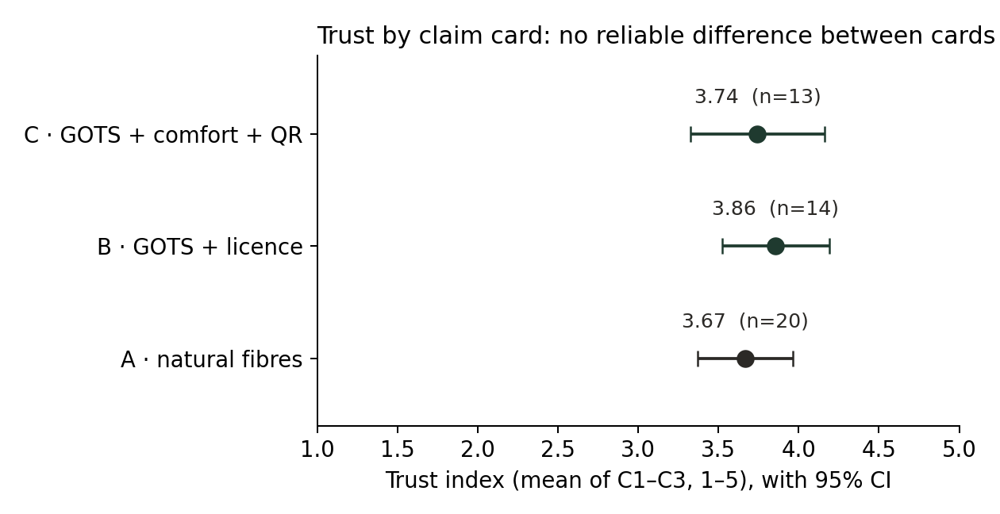
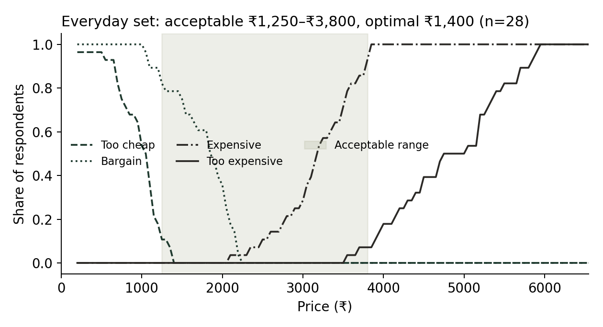
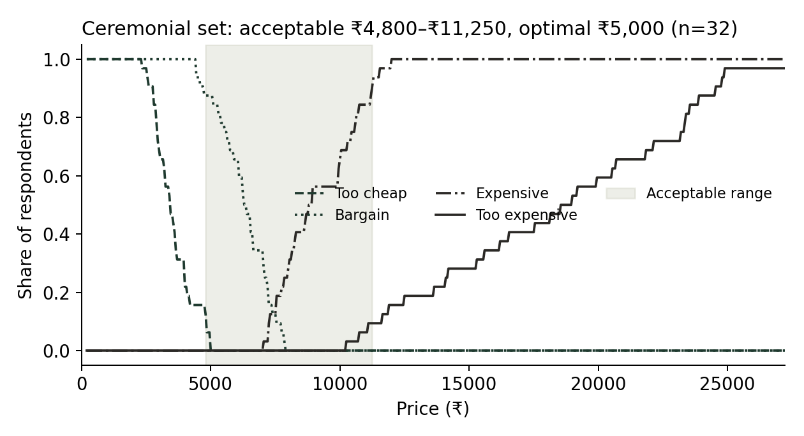
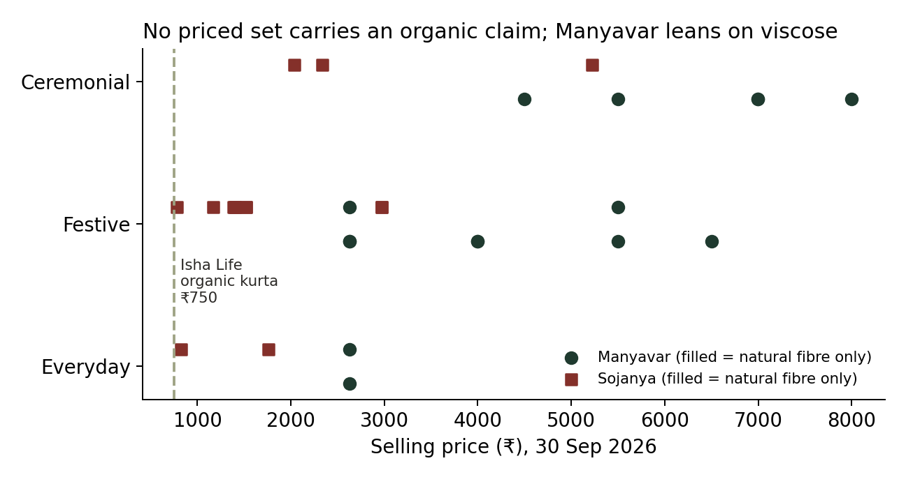
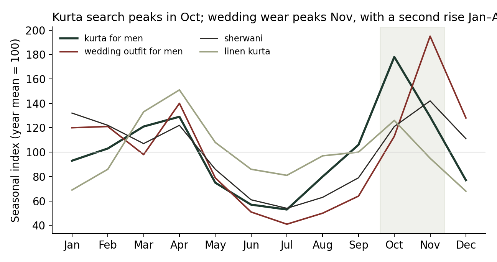
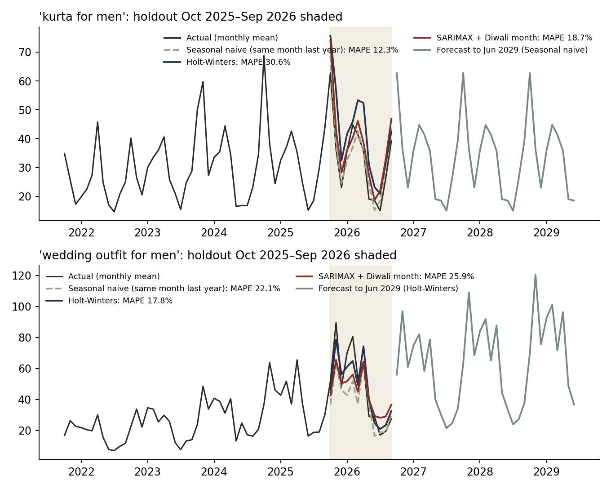
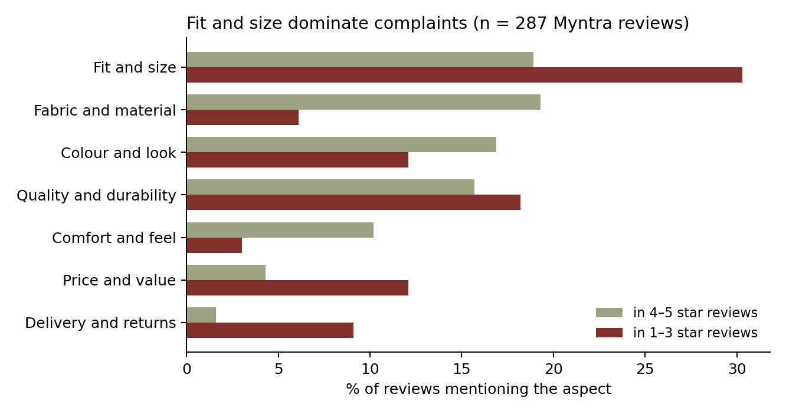
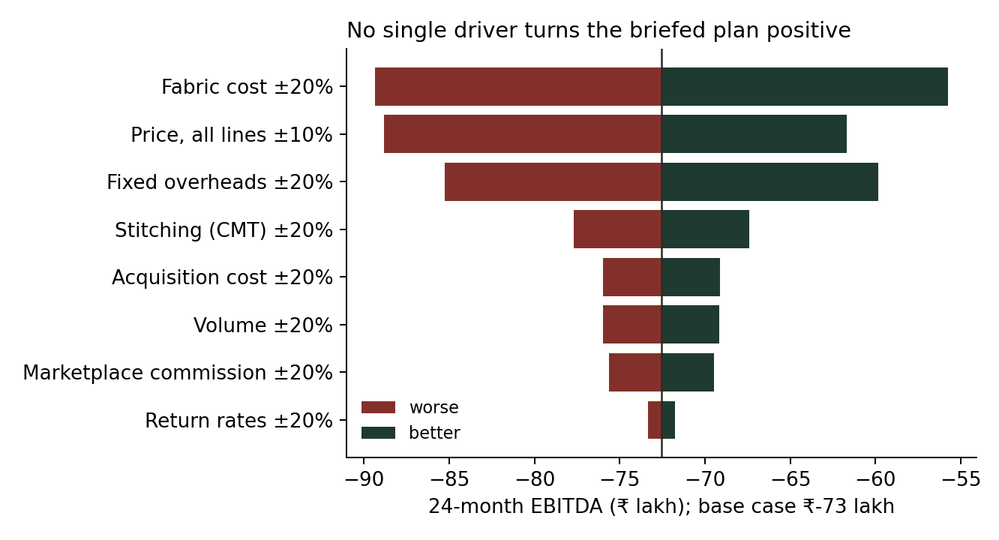

**Recommendation: pivot, then test.** As briefed (four channels including Myntra, full team), TARU loses about ₹73 lakh over 24 months and never breaks even. A leaner plan that drops the marketplace and sells through its own site, festive pop-ups and corporate gifting needs about 280 sets a month to break even, close to the year-2 plan of 250. The festive 2027 pop-up season is the test. Details in sections 9–10.

**Research quality.** The interviews give usable direction on fit, price and proof. The survey does **not**: after exclusions only 47 responses remain (13–20 per claim card, against 64 needed), and the answers fail four standard quality checks. No survey result below should be used for a decision until a fresh, verified sample is collected. The claim test, Kano and pricing results are shown for transparency, not as evidence.

TARU is a fictional brand created for an independent student portfolio project. Consumer findings come from the author's own research with a convenience sample.

# 1. Sample and exclusions

| Step | Removed | Remaining |
|---|---|---|
| Responses received (Forms A, B, C: 60 each) | | 180 |
| Did not consent | 19 | 161 |
| Under 18 | 7 | 154 |
| Screened out (answered "Neither" or left the role question blank) | 24 | 130 |
| Stopped before the claim test | 78 | 52 |
| Failed the attention check | 5 | **47** |

Analysed: Card A 20, Card B 14, Card C 13. Self-buyers 31, gifters 6, "both" 10. Quotas in the brief (50+ self-buyers, 60+ gifters) are not met. 30 price answers written as text ("too low", "very high") were set to missing; city spellings were merged (Bangalore → Bengaluru, and so on).

# 2. Data-quality checks: four fail

| Check | Expected in real survey data | This survey | Verdict |
|---|---|---|---|
| Trust items move together (C1 believe, C2 honest, C3 trust) | Correlation ≈ 0.4–0.7; Cronbach's α ≥ 0.7 | Correlations −0.15 to 0.02; **α = −0.13** | Fail: the three items do not measure one thing |
| Trust predicts purchase intent (C1–C3 vs C4) | Positive correlation | −0.12 to 0.12 | Fail |
| Purchase likelihood falls as price rises (D5 bargain vs D6 expensive) | Lower at the expensive price | **79%** said they were *more* likely to buy at the expensive price (mean 3.8 vs 2.3 on 1–5) | Fail: the reverse of how buyers behave |
| Price answers in order (too cheap ≤ bargain ≤ expensive ≤ too expensive) | Under 10–15% violations | 19 of 47 (40%) everyday; 15 of 47 (32%) ceremonial | Fail |
| Kano answers logically possible | Reverse + questionable under ~5% | 5–23% per feature | Borderline to fail |

A pattern where items that should agree are unrelated, and price responses run backwards, is what answers look like when they are chosen independently at random. It can also come from a form error (for example, a scale printed in reverse) or from respondents clicking through. **Before this data is used anywhere, find the cause:** check the live form's question order and scale labels against the export, and check how the three Sheets were combined.

# 3. Survey results (not decision-grade)

## 3.1 Claim test

| Card | n | Trust (1–5) | Would buy (top 2) | Would pay ≥ 10% over Manyavar |
|---|---|---|---|---|
| A · natural fibres | 20 | 3.67 | 55% | 55% |
| B · GOTS + licence | 14 | 3.86 | 79% | 29% |
| C · GOTS + comfort + QR | 13 | 3.74 | 77% | 38% |

Kruskal-Wallis p = 0.71. Effect sizes (Cohen's d, bootstrap 95% CI): B vs A 0.29 [−0.37, 1.03]; C vs B −0.16 [−1.02, 0.59]; C vs A 0.11 [−0.64, 0.85]. Every interval spans zero and is too wide to rule in or out even a large effect. With α = −0.13 the trust index itself is not valid, so **H2 is untested**, not rejected.

## 3.2 Kano

All six features classify as *Indifferent*: certified organic, QR trail, fuller-build cut, free alterations, comfort guarantee and styling help. Better/worse coefficients are 0.27–0.38 / −0.17 to −0.33. Given the quality checks, this more likely reflects noise than genuine indifference.

## 3.3 Van Westendorp (order-consistent answers only)

| | n | Acceptable range | Optimal price | Indifference price |
|---|---|---|---|---|
| Everyday set | 28 | ₹1,250–₹3,800 | ₹1,400 | ₹2,200 |
| Ceremonial set | 32 | ₹4,800–₹11,250 | ₹5,000 | ₹7,400 |

These ranges agree with the interviews (everyday ₹1,200–2,500; wedding ₹3,500–8,000), which is the one place the survey and the interviews line up. The NMS revenue curve is not computed because the purchase-likelihood answers run backwards (section 2).

## 3.4 Brand look, channel and payment

- **Look preference:** Look 2 (Quiet Proof) 46% [95% CI 32–60%], Look 1 (Heritage) 35% [23–49%], Look 3 (Occasion) 20% [11–33%]. Looks 1 and 2 overlap; no clear winner.
- **Where they'd buy (46 answered, multi-select):** marketplace app 16, brand website 15, through a tailor 14, brand store 13, corporate or festive gift 11, multi-brand store 11, pop-up 6.
- **Pay on delivery: 64%.** Online comfort averages 3.1 of 5. If this holds in clean data, D2C return-to-origin risk is high (see register R062–R064).

# 4. Interviews (11)

Coding in `research/interviews/interview_coding.csv`.

| Theme | Evidence | Count |
|---|---|---|
| **Standard sizes fail mature builds** | Belly, chest, armholes, neck or sleeves named as a problem | 8 of 9 buyers + both practitioners |
| **Proof: certification tag leads, narrowly** | First choice: P1 tag 4, P2 QR trail 3, P3 comfort guarantee 2 (buyers); both practitioners chose P1 | 4 / 3 / 2 |
| **"Organic" means the wearer's skin before the planet** | Skin or health 4, planet or ethics 3, purity or tradition 2 | 4 / 3 / 2 |
| **Touch before purchase** | Prefer store or boutique for hand-feel: 5 of 9; open to online with easy returns: 4 of 9 | 5 / 4 |
| **Everyday price** | Self-buyers: ₹1,200–2,500 (median ₹2,000) | 5 |
| **Gift budget** | ₹2,000–10,000, with packaging expected as standard | 4 |

**What interviews did not deliver.** Neither practitioner gave margin, sale-or-return or payment-term ranges, the main purpose of those interviews (R069 stays an assumption). The "surprises" field cites hypotheses by the wrong number in two notes (online channels are H5, not H3). The notes are Claude-cleaned summaries of recordings; keep the original recordings privately so any quote can be checked against source.

# 5. Price audit (30 products, read from brand pages on 29–30 Sep 2026)

| Brand | Sets priced | Median selling price | Range | Average discount off MRP | Natural fibre only |
|---|---|---|---|---|---|
| Manyavar | 15 | ₹4,499 | ₹2,624–7,999 | 0% | 3 of 15 |
| Sojanya | 14 | ₹1,517 | ₹777–5,226 | 68% | 14 of 14 |
| Isha Life (organic kurta only, anchor) | 1 | ₹750 | | 0% | yes |

- **None of the 29 sets makes any organic or certification claim.** The white space for certified-organic occasion wear holds.
- **The market leader sells mostly viscose.** 12 of 15 Manyavar sets are viscose, georgette, art silk or brocade. A certified natural-fibre set is a real point of difference against Manyavar, not only against discounters.
- **Manyavar never discounts; Sojanya lists at an MRP it almost never charges** (68% off on average). TARU's "no markdowns on Ceremonial" rule matches the leader, not the discounter.
- **The everyday premium is tight.** Manyavar's natural-fibre everyday set sells at ₹2,624; 10% above that is about ₹2,900. Interviewees expect ₹1,200–2,500 for everyday, and the survey's indifference price is ₹2,200. A 10% premium looks achievable on festive and ceremonial sets (Manyavar ceremonial median about ₹6,000, survey acceptable range up to ₹11,250), not on everyday.
- **Gap:** Tasva (16 sets) and Fabindia (2) pages need a browser to show prices, so they are not priced. Brief target was 40+ sets from 6+ brands; this audit has 30 from 3.

# 6. Demand seasonality and geography (Google Trends, India, Sep 2021–Sep 2026)

Seasonal index, 2022–2025 average (each year's mean = 100):

| Term | Peak months | Trough | Five-year trend (annual mean, 2021 → 2026) |
|---|---|---|---|
| kurta for men | **Oct (178)**, Apr, Nov | Jun–Jul | 26 → 31, broadly flat |
| wedding outfit for men | **Nov (195)**, Apr, Dec | Jul–Aug | 21 → 43, doubled |
| sherwani | Nov (142), Jan, Feb | Jun–Jul | 79 → 44, falling |
| linen kurta | Apr (151), Mar, Oct | Dec–Jan | 17 → 61, **more than tripled** |
| organic cotton | Nov, Feb (flat otherwise) | | 9 → 21; the 2026 rise is mostly a one-week spike in Feb 2026 |

- **Demand peaks Oct–Nov** (Diwali, then wedding season), with a second, smaller rise Jan–Apr (weddings, then summer linen). Stock for the peak must land by September, so the cash low point falls in Aug–Sep. **H6 is supported.**
- **Linen is the fastest-growing search** and peaks in the summer months, when ethnic demand otherwise falls. An everyday linen line would smooth the calendar.
- **Geography:** Delhi and Maharashtra rank top-2 on almost every term; Karnataka is strong on linen and organic cotton. This supports Delhi NCR, Mumbai, Pune and Bengaluru as launch cities. Tamil Nadu and Goa search most for "organic cotton" but little for kurtas, so they are not launch markets.
- Trends show relative search interest, not sales; treat them as timing evidence only.

## 6.1 AI7: demand forecast

Three methods were trained on Oct 2021 – Sep 2025 and tested on the 12 months they had not seen (Oct 2025 – Sep 2026). Error is mean absolute percentage error (MAPE); lower is better.

| Method | "kurta for men" | "wedding outfit for men" |
|---|---|---|
| Same month last year (baseline) | **12.3%** | 22.1% |
| Holt-Winters exponential smoothing | 30.6% | **17.8%** |
| SARIMAX with a Diwali-month regressor | 18.7% | 25.9% |

- **For everyday kurta demand, the simple baseline wins.** The season repeats so closely that the models add error, mostly by over-reacting to the Diwali date moving between October and November. A model is kept only if it beats the baseline; here it does not.
- **For wedding wear, Holt-Winters wins** because it picks up the upward trend (searches doubled since 2021). Its long-range forecast assumes that growth continues, so treat 2028–29 levels as optimistic.
- **Both forecasts peak in October–November in 2027 and 2028**, confirming the timing used in the cash plan (stock paid by September). Monthly weights for Jul 2027 – Jun 2029 are in `data/clean/ai7_forecast_results.json`.
- Code: `notebooks/10_demand_forecast.py`. Google Trends measures search interest, not sales.

## 6.2 AI2: review complaint map (287 Myntra reviews)

Reviews were copied by hand from Myntra on 30 Sep 2026: Fabindia 199, Manyavar 85, Tasva 3 after removing 5 blank and 4 duplicate rows. Reviewer names were dropped on load. 33 reviews are rated 1–3 stars. Each review is tagged against a published keyword list (`notebooks/02_review_complaint_map.py`); an NMF topic model on TF-IDF features is run alongside as an unsupervised check.

| Aspect | Share of all reviews | In 1–3 star reviews | In 4–5 star reviews |
|---|---|---|---|
| Fit and size | 20% | **30%** | 19% |
| Fabric and material | 18% | 6% | 19% |
| Colour and look | 16% | 12% | 17% |
| Quality and durability | 16% | 18% | 16% |
| Comfort and feel | 9% | 3% | 10% |
| Price and value | 5% | **12%** | 4% |
| Delivery and returns | 2% | 9% | 2% |

- **Fit and size is the top complaint.** It appears in 30% of low-rated reviews against 19% of high-rated ones. Size complaints run both ways ("too big, especially sleeves", "little tight", "length is too long"). The topic model finds the same thing: its size topic has the lowest average rating of the five topics (3.6 stars).
- **Fabric and comfort are what people praise.** They appear three times more often in good reviews than in bad ones. For a natural-fibre brand, fabric is expected; the gap a new brand can own is fit.
- **Price and delivery are mentioned rarely, but mostly in complaints.**
- **4% of reviews say the kurta was bought for someone else** (father, husband, brother, teacher), a small but visible gifting signal.
- This agrees with the interviews, where 8 of 9 buyers named a fit problem.

**Limits.** 287 reviews against a target of 400; Tasva is almost absent; only 1 review is in Hinglish, so AI1's English-vs-Hinglish comparison cannot be run. Reviews skew positive (89% rated 4–5), as marketplace reviews usually do.

# 7. Status of the hypotheses

| | Hypothesis | Status | Why |
|---|---|---|---|
| H1 | Self-buyer is the stronger first customer | **Untested** | 6 gifters analysed; quality checks fail |
| H2 | Certification raises trust; benefit + QR raises it further | **Untested** | Arms 13–20 (need 64); trust scale invalid |
| H3 | Market big enough | Not a survey question | Sizing v1 stands; search growth for wedding wear and linen supports it |
| H4 | ≥ 10% premium over Manyavar, ≥ 50% margin | **Rejected on margin**; premium feasible only for festive and ceremonial | Everyday: 10% over Manyavar (~₹2,900) sits above interview and survey expectations (~₹2,000–2,200). Festive and ceremonial: room for a premium. Margin untested until the cost stack |
| H5 | D2C and marketplace both positive; a low-cost channel beats modern trade | **Partly rejected** | D2C positive; marketplace negative on every line; pop-ups earn most per set |
| H6 | Peak Oct–Dec; cash low 1–2 months before | **Supported** | Kurta peaks Oct, wedding wear Nov |

# 8. Economics (model/taru_economics.xlsx)

Base case: 1,800 sets in year 1 and 3,000 in year 2 (sizing v1), sold July 2027 – June 2029 on the Google Trends season.

| Line | Price | GST | Cost per set (COGS) | Gross margin | Clears the 50% floor? |
|---|---|---|---|---|---|
| Everyday | ₹2,499 | 5% | ₹1,507 | 37% | No |
| Festive | ₹4,999 | 18% | ₹2,700 | 36% | No |
| Ceremonial (with jacket) | ₹8,999 | 18% | ₹5,528 | 28% | No |

Fabric cost uses IndiaMART GOTS organic cotton listings (₹110–350 per metre) and stitching job-work rates (₹300–700 per set); trims, packaging and certification are assumptions. **No line reaches H4's 50% gross-margin floor**; Manyavar's is 65.7% on mostly viscose fabric. Certified natural fibre costs more, and the price ceiling people accept leaves little room.

**Contribution per set, after channel costs and acquisition:**

| Channel | Everyday | Festive | Ceremonial |
|---|---|---|---|
| Own website (D2C) | ₹117 | ₹699 | ₹1,114 |
| Marketplace (Myntra, 27.5% commission) | **−₹151** | **−₹44** | **−₹499** |
| Pop-up | ₹360 | ₹974 | ₹1,446 |
| Corporate gifting (15% off) | ₹282 | ₹664 | ₹711 |

**The marketplace loses money on every line** at a press-estimated 27.5% commission (register R069, low confidence). Pop-ups earn the most per set because there is no shipping or return cost. Blended across the plan, each set contributes ₹355 (9%).

| Result (base case) | As briefed | Pivot plan |
|---|---|---|
| Contribution per set | ₹355 | ₹677 |
| Sets per month needed to break even | ~957 | **~281** |
| 24-month EBITDA | −₹72.6 lakh | −₹18.1 lakh |
| Peak funding need (lowest cumulative cash) | ₹77.6 lakh | ₹27.5 lakh |

Pivot plan = no marketplace (own website 40%, pop-ups 30%, corporate gifting 30%); overheads ₹1.5 lakh a month; brand content ₹40,000 a month; launch spend ₹5 lakh; everyday fabric at ₹140/m.

Fabric cost, fixed overheads and price move the 24-month result most. No single ±20% change turns the brief's plan positive, which is why the pivot changes channels and overheads together.

# 9. Recommendation: pivot, then test

1. **Do not launch as briefed.** Four channels with a marketplace and a full team cannot break even at prices buyers accept for certified natural fibre.
2. **Pivot the launch** to festive and wedding occasion wear sold through pop-ups, corporate festive gifting and the brand's own site. Keep everyday as a small entry line priced under the ₹2,500 GST slab; it is a door-opener, not a margin line.
3. **Lead the message with fit and comfort, with certification as proof.** Interviews put fit first (8 of 9 buyers), fit is the top complaint in competitor reviews, and buyers read "organic" as skin comfort; the survey cannot yet confirm the claim test.
4. **Test before scaling:** run 3–4 pop-ups in Oct–Nov 2027 (the Trends peak). Go on if they sell at least ~280 sets a month at full price with under 5% returns. If not, stop, or move to a supplier-brand or corporate-gifting-only model.
5. **Conditions that would change this call:** a GOTS fabric source under ₹140/m for festive linen; a marketplace commission under 15%; a clean survey showing a significant trust lift for certification (Card B vs A).

# 10. What would make the survey decision-grade

1. Find the cause of the failed checks (section 2) before collecting more.
2. Target **64+ usable responses per card** (about 200 usable in total). At this survey's completion rate (47 of 130 qualified), that needs about 550 qualified starts, so shorten the form: the drop-off happened before the claim test.
3. Recruit more gifters: 6 is too few to compare segments.
4. Keep this dataset as a documented pilot in the repo, not as the result.
